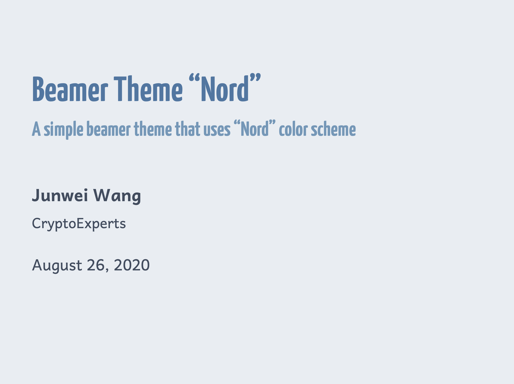
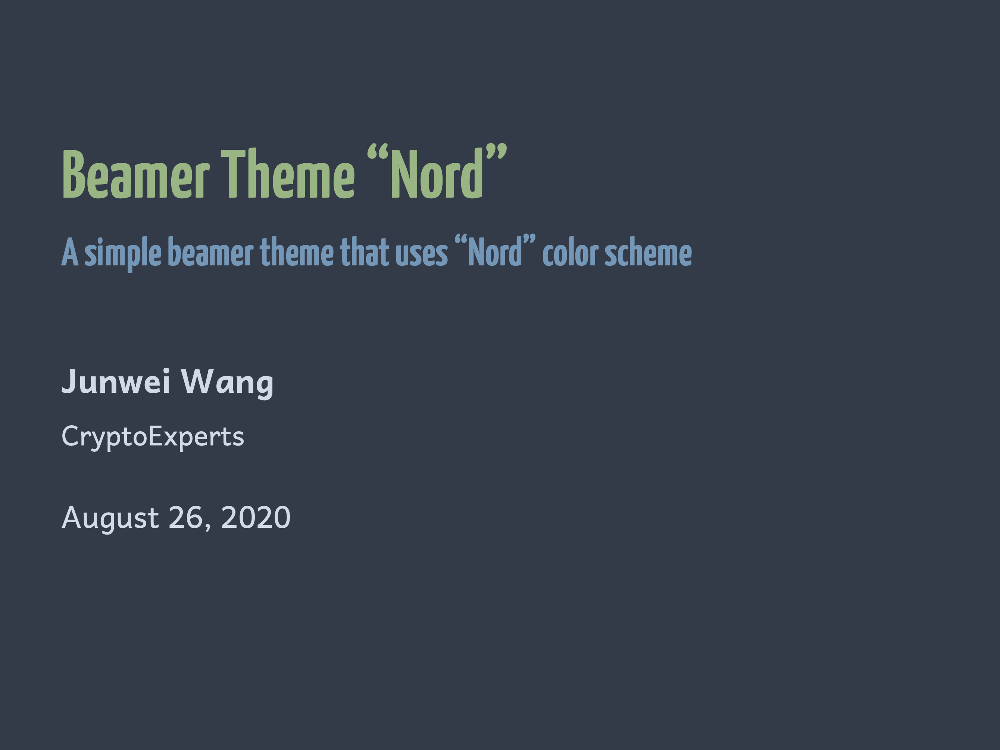
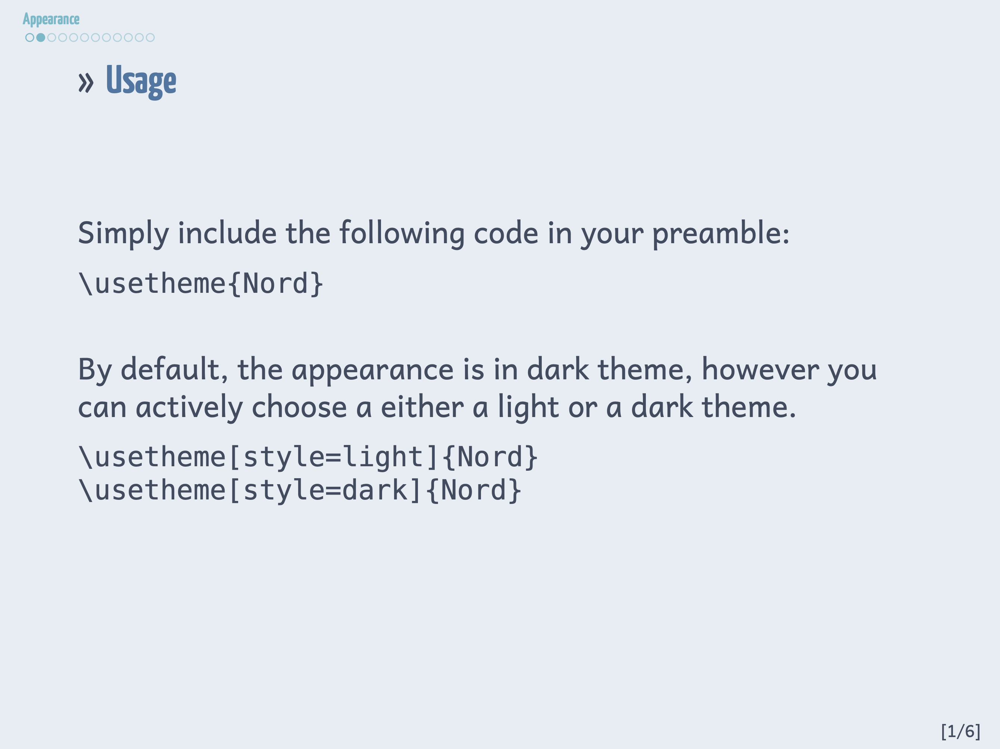
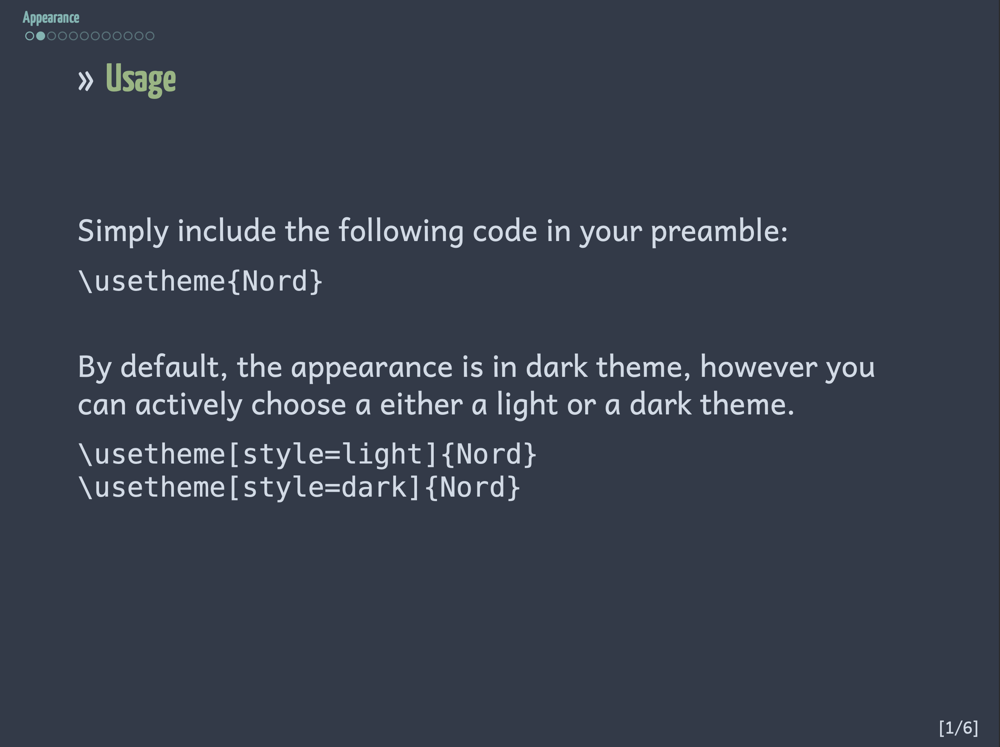
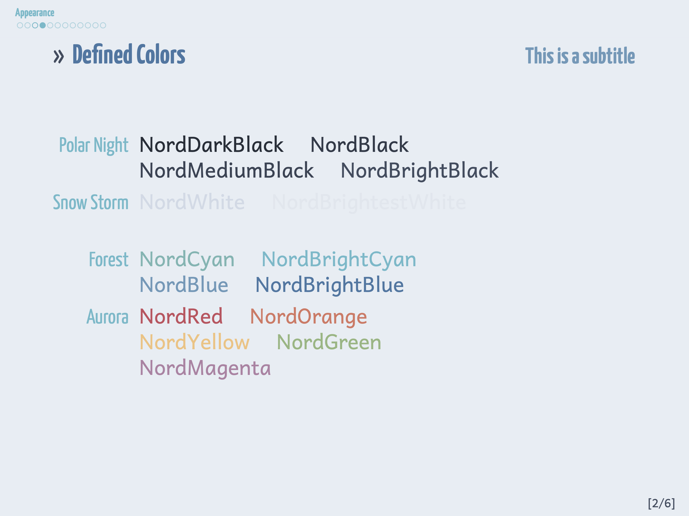
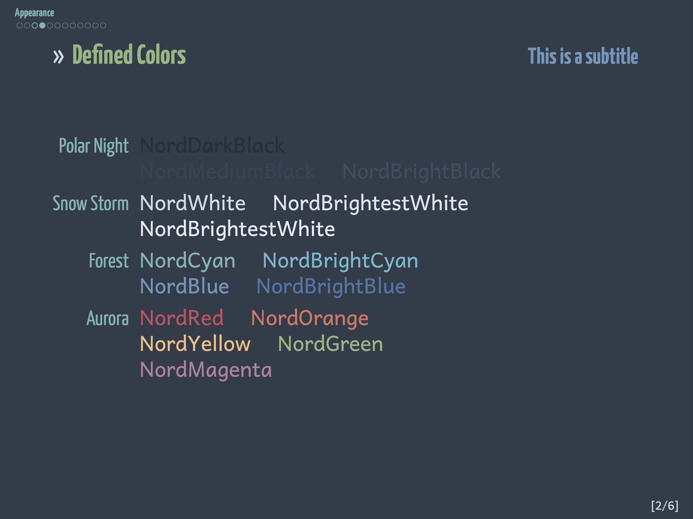
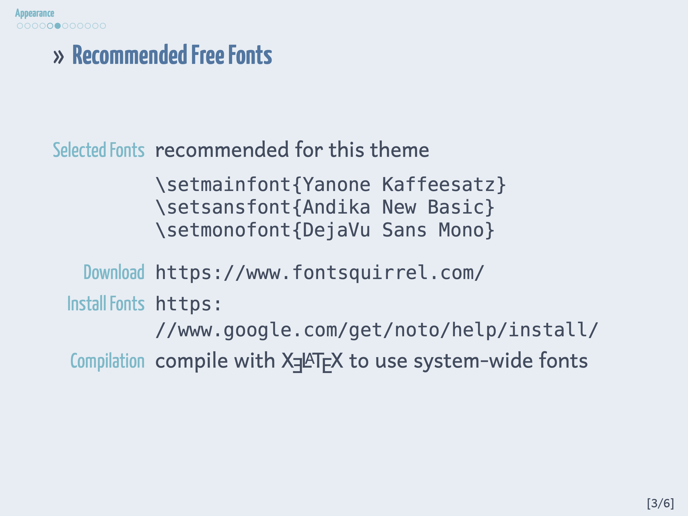
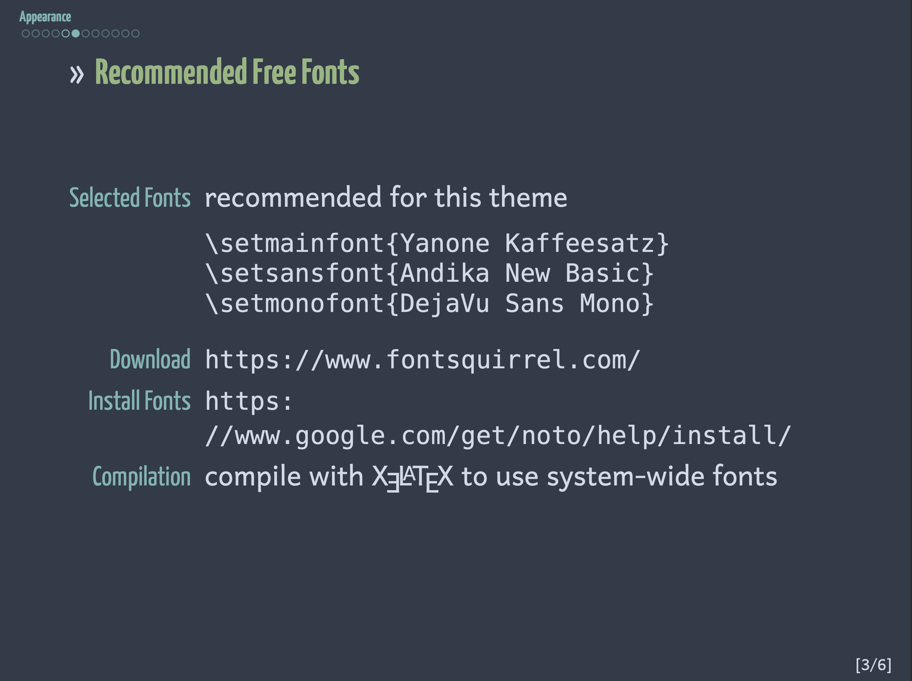
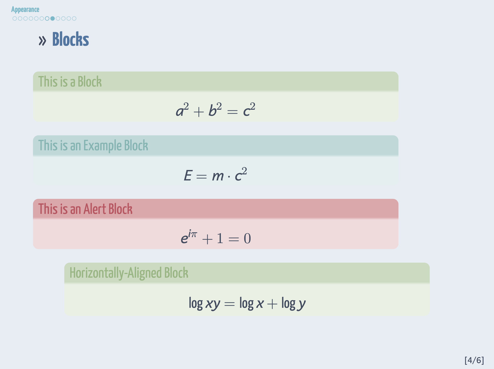
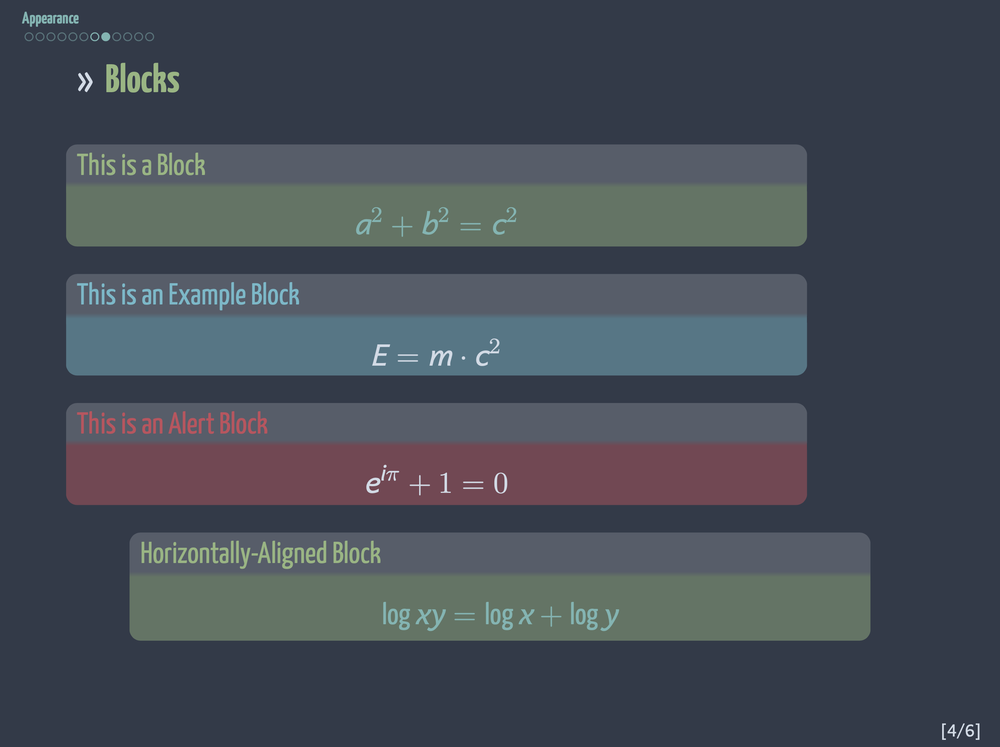

# The Nord Beamer Theme

A beamer theme using [Nord](https://www.nordtheme.com/) color scheme.

Pull requests and issues are welcome.

## News

- This theme is now available both at see [CTAN](https://ctan.org/pkg/beamerthemenord) (see [CTAN announcement](https://ctan.org/ctan-ann/id/mailman.2913.1593882783.3866.ctan-ann@ctan.org))  and [Overleaf](https://www.overleaf.com/latex/templates/beamerthemenord/xyjjhcsyyjbr).

- Added light/dark style option

## Installation

### Tex Live /  MacTeX

[Tex Live](https://www.tug.org/texlive/) and [MacTeX](https://www.tug.org/mactex/) users can install/update **beamerthemeNord** by using
```sh
tlmgr update --self beamerthemenord
```

### Manual

If you want to customize this theme, you can also clone this repository and copy all `*.sty` files into the directory where you main `tex` source file is.

## Usage 

See [beamerthemeNord.pdf](./beamerthemeNord.pdf) or [beamerthemeNord.tex](./beamerthemeNord.tex)

**Note**: This theme currently only supports XeLaTeX, which is convinent to use system-wide fonts and to write in non-ASCII characters.
You are weclome to contribute on compatability for other TeX distributions.

## Screenshots

Light Style                             |  Dark Style
----------------------------------------|---------------------------------------
  |  
      |  
     |  
      |  
     |  
        |  


## Usecases

Please send a pull request to add your usecase

- [Ph.D. defense of Junwei Wang](https://junwei-wang.github.io/pdfs/slides/2020-phd-defense-handout.pdf)

## Maintainer

Junwei Wang (i.junwei.wang@gmail.com)

## License

This work may be distributed and/or modified under the conditions of the LaTeX Project Public License, either version 1.3c of this license or (at your option) any later version. The latest version of this license is in http://www.latex-project.org/lppl.txt .